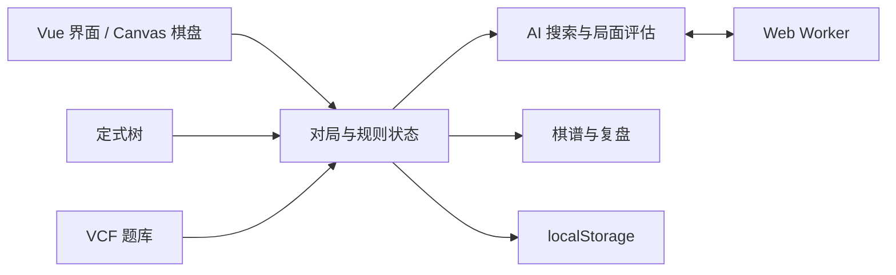

<div align="center">

# 枰间 Pingjian

### 落子之间，自有天地。

一款离线优先的五子棋与连珠对弈、研习和复盘应用。

[**在线体验**](https://pth2000.github.io/pingjian/) · [项目仓库](https://github.com/pth2000/pingjian) · [问题反馈](https://github.com/pth2000/pingjian/issues) · [第三方来源](THIRD_PARTY.md)

</div>

---

枰间希望把一套完整的五子棋与连珠体验放进浏览器：既能随时与电脑或身边的人下一盘，也能系统查阅定式、练习杀法，并在对局后回看关键转折。

它不要求注册账号，不依赖业务服务器，也不会上传棋局。AI 搜索、存档和复盘都在本地完成；生产版还可以构建成能够直接双击打开的离线页面。

## 为什么是枰间

- **离线优先**：核心功能不需要后端，页面、字体和 AI 引擎均可打包到本地。
- **规则完整**：从日常的无禁手，到世界五子棋和世界连珠常用的开局规则，都在同一套对弈流程中。
- **不只分胜负**：定式浏览、谱内练习、VCF 杀法和赛后复盘组成了一条完整的研习路径。
- **数据属于用户**：战绩、棋谱和进度保存在浏览器中，可以随时导出完整备份。
- **附加内容可选**：人物、札记与故事只是额外的氛围层，可以关闭，不影响对弈与研习功能。

## 功能一览

| 领域 | 能力 |
| --- | --- |
| 对弈 | 人机对弈、本地双人对弈、自选执子、猜先、悔棋、认输和中途续下 |
| 电脑对手 | 6 位行棋风格不同的对手，4 档搜索难度，在 Web Worker 中运行 |
| 棋规 | 无禁手、标准五子棋、连珠（三三、四四、长连禁手） |
| 开局规则 | Swap、Swap2、Pro、Long Pro、RIF、山口、索索夫-8、塔拉古奇-10 |
| 定式 | 连珠 26 种标准开局，支持变化浏览、候选点、谱内练习和出谱续推 |
| 杀法 | 31 道连续冲四（VCF）题，提供分级、提示、答案演示和完成记录 |
| 分析 | 候选点提示、胜率走势、失误标记、逐手复盘和棋谱代码 |
| 档案 | 多角色、分规则战绩、历史棋谱、成就和完整数据备份 |
| 适配 | 桌面、平板与手机布局，棋盘页支持键盘操作 |

## 开始使用

### 在线版

打开 [pth2000.github.io/pingjian](https://pth2000.github.io/pingjian/) 即可使用。首次进入时创建一个本地角色，之后的设置、战绩、棋谱和练习进度会自动保存。

### 离线版

从源码构建离线包：

```bash
npm ci
npm run release
```

构建结果位于：

```text
release/
├─ pingjian/
│  ├─ index.html
│  ├─ coaches.js
│  ├─ avatars.js
│  └─ README.txt
└─ pingjian.zip
```

解压 `pingjian.zip` 后双击 `index.html` 即可运行，不需要安装或联网。

## 规则与内容

枰间将“棋规”与“开局规则”组合成可直接选择的比赛预设，避免出现现实比赛中不存在的搭配。

- **无禁手**：双方均无禁手，五子及以上即胜。
- **标准五子棋**：双方均无禁手，须恰好连成五子。
- **连珠**：黑方有三三、四四和长连禁手，白方无禁手。
- **世界五子棋**：标准五子棋搭配 Swap2、Swap、Pro 或 Long Pro。
- **世界连珠**：连珠搭配索索夫-8、山口、RIF 或塔拉古奇-10。

定式、题目、字体及其他第三方内容的来源和使用条款见 [THIRD_PARTY.md](THIRD_PARTY.md)。

## 数据与隐私

项目没有账号系统，不会将棋局或个人记录发送到远程服务器。下列数据均保存在当前浏览器的 `localStorage` 中：

- 角色与偏好设置；
- 战绩、棋谱与成就；
- 定式、杀法和可选故事的进度。

更换设备、更换浏览器或清理站点数据前，请在“我的 → 数据”中导出 `pingjian-backup-YYYYMMDD.json`。导入时会合并角色：同一角色的数据被替换，本机其他角色会保留。改名前由项目导出的备份仍可导入。

## 技术架构

核心技术栈为 Vue 3、Vite、Pinia 和 Vue Router。棋盘使用 Canvas 绘制，AI 搜索默认运行在 Web Worker 中；Worker 不可用时会自动回退到主线程。路由采用 Hash 模式，因此生产页面可以在 `file://` 下直接运行。



### 目录结构

```text
src/
├─ engine/      AI 搜索、局面评估与棋规判定
├─ game/        开局、落子、结算、存档与复盘
├─ openings/    定式浏览与谱内练习
├─ puzzles/     连续冲四练习
├─ components/  Vue 界面组件
├─ views/       页面组件
├─ stores/      Pinia 界面状态
├─ story/       可选的人物与故事内容
├─ features/    成就等附加功能
└─ data/        定式树与题目数据
```

生产构建会将业务代码、样式、字体、画像和 Worker 内联到 `index.html`。`public/coaches.js` 与 `public/avatars.js` 作为可定制资源单独保留。

## 本地开发

### 环境要求

- Node.js 22.12 或更高版本；
- npm；
- 需要运行浏览器回归测试时，安装 Playwright Chromium。

```bash
git clone https://github.com/pth2000/pingjian.git
cd pingjian
npm ci
npm run dev
```

开发服务器默认运行在 `http://localhost:5173`。

### 常用命令

| 命令 | 用途 |
| --- | --- |
| `npm run dev` | 启动开发服务器与热更新 |
| `npm run build` | 构建生产版到 `dist/` |
| `npm run preview` | 预览生产构建 |
| `npm run check` | 检查模块导入与未使用导出 |
| `npm test` | 构建并运行全部 Playwright 回归测试 |
| `npm test -- story` | 只运行文件名包含 `story` 的测试 |
| `npm test -- --no-build` | 复用现有 `dist/` 运行测试 |
| `npm run release` | 构建 `release/pingjian.zip` 离线包 |

首次运行浏览器测试前：

```bash
npx playwright install chromium
```

## 定制电脑对手

发布包中的 `coaches.js` 与 `avatars.js` 可以直接编辑，不需要重新打包主页面。

- `coaches.js`：对手的名称、棋风、台词与可选图片配置；
- `avatars.js`：内嵌头像资源。

修改前建议保留原文件，以便在格式错误时快速恢复。

## 部署

`.github/workflows/pages.yml` 已配置 GitHub Pages：推送到 `master` 分支后，Actions 会使用 Node.js 22 安装锁定依赖，执行静态检查和生产构建，然后发布 `dist/`。

首次启用时，在仓库的 **Settings → Pages → Build and deployment** 中将 Source 设为 **GitHub Actions**。

## 参与贡献

欢迎提交 [Issue](https://github.com/pth2000/pingjian/issues) 或 Pull Request。修改代码前，建议先从 `master` 创建独立分支；提交前至少运行：

```bash
npm run check
npm run build
```

涉及交互、棋规、存档或响应式布局时，请同时运行相关 Playwright 测试。新增第三方数据、字体或图像时，请在 [THIRD_PARTY.md](THIRD_PARTY.md) 中补充来源与许可信息。

## 许可与致谢

项目代码及原创内容采用 [MIT License](LICENSE) 发布。字体、定式、杀法题及其他第三方内容遵循各自的许可或使用条款，详情见 [THIRD_PARTY.md](THIRD_PARTY.md)。

感谢 RenLib 社区累积的连珠资料，以及开源连珠程序 [Rapfi](https://github.com/dhbloo/rapfi) 对部分开局变化推演的支持。
